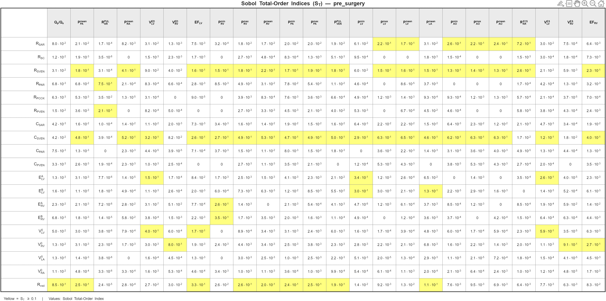
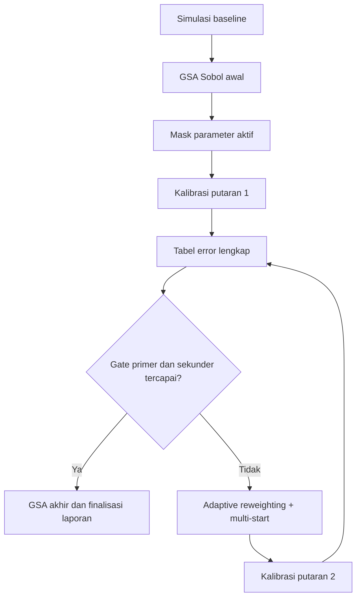

# Bagian B: Analisis Hasil dan Rencana Peningkatan

## 1. Hasil Error Lengkap (Ditampilkan di Awal)

Bagian ini menyajikan hasil error lengkap pascakalibrasi berdasarkan screenshot tabel error yang Anda lampirkan. Penyajian lengkap ini sengaja ditempatkan di awal agar pembaca memperoleh gambaran kuantitatif penuh sebelum masuk ke interpretasi.

**Gambar rujukan yang disisipkan di naskah:**
- Screenshot tabel error pascakalibrasi (lampiran pengguna)

> Tempatkan screenshot tersebut tepat di bawah paragraf ini pada dokumen laporan akhir.

### 1.1 Tabel error lengkap pascakalibrasi (sesuai screenshot)

| Metrik | Unit | Nilai Klinis | Nilai Kalibrasi | Error (%) |
|---|---|---:|---:|---:|
| RAP_mean | mmHg | 5.0000 | 6.7533 | 35.0650 |
| PAP_min | mmHg | 35.0000 | 13.0090 | -62.8330 |
| PAP_max | mmHg | 35.0000 | 22.9770 | -34.3500 |
| PAP_mean | mmHg | 28.0000 | 17.2470 | -38.4040 |
| SAP_mean | mmHg | 52.0000 | 52.8540 | 1.6422 |
| QpQs | - | 3.4400 | 3.4029 | -1.0795 |
| PVR | WU | 11.5000 | 4.9359 | -57.0790 |
| SVR | WU | 98.5000 | 92.8670 | -5.7190 |
| LVEDV | mL | 30.0000 | 16.8910 | -43.6960 |
| LVESV | mL | 10.0000 | 6.2173 | -37.8270 |
| RVEDV | mL | 25.0000 | 15.9750 | -36.0990 |
| RVESV | mL | 12.0000 | 10.6770 | -11.0290 |
| LVEF | - | 0.6700 | 0.6319 | -5.6829 |

### 1.2 Ringkasan awal dari tabel penuh
Secara kuantitatif, model sudah mencapai kecocokan baik pada metrik primer aliran-tekanan sistemik (Qp/Qs dan SAP_mean), namun masih menunjukkan deviasi besar pada domain hemodinamika pulmonal (PAP, PVR) dan volume ventrikel (LVEDV, LVESV, RVEDV).

## 2. Ikhtisar Hasil

### 2.1 Ikhtisar performa model setelah kalibrasi
Pascakalibrasi, model menunjukkan pola berikut:
- **Tercapai baik:** SAP_mean (error 1.64%) dan Qp/Qs (error -1.08%).
- **Borderline:** LVEF (error -5.68%) dan SVR (error -5.72%).
- **Belum tercapai:** seluruh indikator utama pulmonal (PAP_min, PAP_max, PAP_mean, PVR) serta volume ventrikel kiri-kanan.

Implikasi langsung:
- Optimizer berhasil menyesuaikan keseimbangan aliran dan tekanan sistemik rata-rata.
- Namun, representasi tekanan pulmonal absolut dan skala volume jantung masih belum memadai untuk klaim kecocokan fisiologis menyeluruh.

### 2.2 Evaluasi morfologi gelombang tekanan (baseline vs pascakalibrasi)
Gunakan figur hasil simulasi berikut:
- [results/figures/ChamberPressures_Baseline_pre_surgery.pdf](results/figures/ChamberPressures_Baseline_pre_surgery.pdf)
- [results/figures/ChamberPressures_Calibrated_pre_surgery.pdf](results/figures/ChamberPressures_Calibrated_pre_surgery.pdf)

Interpretasi fisiologis dari dua screenshot/figur chamber pressure:
- Puncak sistolik ventrikel kanan meningkat setelah kalibrasi (sekitar 15 mmHg menjadi mendekati 20 mmHg), menunjukkan koreksi parsial dinamika sisi kanan.
- Kurva RA dan LA tetap periodik dan halus, tanpa indikasi instabilitas numerik yang nyata.
- Bentuk kurva LV tetap fisiologis, tetapi perubahan amplitudo belum cukup untuk menutup gap volume LV terhadap target klinis.

Kesimpulan ringkas:
- Kalibrasi memperbaiki konsistensi dinamik gelombang tekanan, tetapi belum mengonversi perbaikan tersebut menjadi akurasi kuat pada metrik pulmonal dan volumetrik.

## 3. Analisis Tabel Error (Sebelum/Sesudah Kalibrasi)

### 3.1 Stratifikasi residual error pascakalibrasi

| Kategori | Ambang | Metrik dominan |
|---|---|---|
| Sangat baik | \|error\| <= 5% | SAP_mean, QpQs |
| Batas terima | 5% < \|error\| <= 10% | LVEF, SVR |
| Perlu perbaikan besar | \|error\| > 10% | RAP_mean, PAP_min, PAP_max, PAP_mean, PVR, LVEDV, LVESV, RVEDV, RVESV |

### 3.2 Pola residual yang sistematis
Residual tidak bersifat acak, melainkan membentuk dua klaster fisiologis yang jelas:
- **Klaster pulmonal:** PAP_min, PAP_max, PAP_mean, PVR
- **Klaster volumetrik ventrikel:** LVEDV, LVESV, RVEDV

### Mengapa pola ini bisa muncul (berdasarkan framework kode)
Secara sederhana, pipeline saat ini memang lebih mudah “memenangkan” target global dibanding target pulmonal dan volume. Penyebab utamanya sebagai berikut.

1. **Penyaringan parameter aktif dari GSA masih kasar pada tahap awal.**  
Pada setup Sobol saat ini, ukuran sampel untuk screening relatif kecil, lalu hasilnya langsung dipakai untuk membuat mask parameter optimasi. Jika screening awal belum stabil, parameter yang sebenarnya penting untuk PAP dan volume bisa tidak cukup diutamakan pada tahap kalibrasi.

2. **Fungsi objektif memberi tekanan sangat kuat ke metrik primer tertentu.**  
Di objective kalibrasi, ada penalti pengali besar ketika Qp/Qs, SAP_mean, atau LVEF melewati ambang. Ini efektif menjaga target primer, tetapi konsekuensinya optimizer cenderung mencari solusi yang cepat memperbaiki tiga metrik tersebut, walaupun PAP dan volume belum ikut membaik secara proporsional.

3. **Set parameter bebas pre-surgery belum sepenuhnya kaya untuk membetulkan seluruh fenomena pulmonal.**  
Pada konfigurasi pre-surgery, parameter aktif didominasi resistansi, sebagian elastance, dan volume tak-tegang tertentu. Untuk menyesuaikan tekanan pulmonal (min, max, mean) sekaligus volume ventrikel secara bersamaan, kombinasi parameter yang tersedia bisa belum cukup fleksibel dalam satu putaran kalibrasi.

4. **Ada gejala kompensasi parameter.**  
Hasil GSA akhir menunjukkan peran R.vsd tetap sangat dominan pada beberapa keluaran. Artinya optimizer banyak memakai “jalur cepat” melalui resistansi shunt untuk mengejar kecocokan global, bukan memperbaiki semua subsistem secara merata.

5. **Mode kalibrasi memakai toleransi steady-state yang lebih longgar dibanding evaluasi akhir.**  
Ini mempercepat komputasi, tetapi bisa membuat objective kurang sensitif terhadap detail ekstrem gelombang (misalnya PAP_min/PAP_max). Akibatnya, nilai rata-rata global bisa sudah baik sementara indikator pulmonal detail masih meleset.

### Makna ilmiah dari pola residual
Dengan kondisi di atas, solusi kalibrasi saat ini berada pada **kompromi global**: target aliran-tekanan utama (Qp/Qs, MAP) tercapai, tetapi fidelity fisiologis menyeluruh pada sistem pulmonal dan skala volume ventrikel belum tercapai. Jadi, masalah utamanya bukan sekadar “optimizer gagal”, melainkan kombinasi antara struktur objective, pemilihan parameter aktif, dan derajat identifiabilitas data klinis yang tersedia.

## 4. Interpretasi Analisis Sensitivitas (GSA Awal vs Akhir)

### 4.1 Sumber data dan gambar
- Matriks Sobol akhir: [results/gsa/gsa_matrix_table_pre_surgery.png](results/gsa/gsa_matrix_table_pre_surgery.png)
- Overlay numerik ST awal-akhir: [results/tables/gsa_overlay_pre_surgery.csv](results/tables/gsa_overlay_pre_surgery.csv)

Untuk naskah:
- Sisipkan screenshot matriks Sobol awal (dari run capture Anda) sebagai Gambar B3.
- Sisipkan [results/gsa/gsa_matrix_table_pre_surgery.png](results/gsa/gsa_matrix_table_pre_surgery.png) sebagai Gambar B4.

Contoh penyisipan gambar Sobol akhir di markdown:

### 4.2 Pergeseran parameter dominan akibat kalibrasi
Contoh kuantitatif utama dari overlay ST:
- **Qp/Qs** tetap didominasi `R.vsd`: 1.000 -> 0.975 (tetap dominan).
- **LVEF** menjadi makin dipengaruhi `R.vsd`: 0.417 -> 0.609.
- **PAP_mean** berpindah dari dominasi tunggal `C.SVEN` ke dominasi campuran:
  - `C.SVEN`: 0.642 -> 0.298 (turun)
  - `R.vsd`: 0.485 -> 0.584 (naik)
- **PVR** tetap resistance-driven tetapi terjadi redistribusi:
  - `R.PAR`: 0.890 -> 0.659 (turun)
  - `R.PCOX`: 0.044 -> 0.271 (naik)

Interpretasi:
- Setelah kalibrasi, `R.vsd` menjadi pengendali global yang lebih kuat, tidak hanya pada shunt ratio tetapi juga pada EF dan PAP_mean.
- Hal ini mengindikasikan bahwa optimizer memanfaatkan jalur kompensasi melalui resistansi defek untuk memenuhi target primer.

## 5. Diskusi Akar Masalah Residual Error

### 5.1 Faktor metodologis
1. Ukuran sampel Sobol untuk screening masih terlalu rendah untuk stabilitas masking pada dimensi parameter yang besar.
2. Pembobotan objective yang sangat melindungi metrik primer dapat mendorong solusi underfit pada domain pulmonal.
3. Penanganan target PAP (minimum-maksimum-mean) berpotensi menimbulkan ambigu optimasi jika tidak dikunci secara konsisten.
4. Satu lintasan local optimization rentan berhenti pada minimum lokal yang layak tetapi belum optimum global.

### 5.2 Faktor identifiabilitas fisiologis
1. Kombinasi parameter yang berbeda dapat menghasilkan Qp/Qs dan MAP serupa, tetapi PAP dan volume berbeda.
2. Metrik pulmonal dan volume dikendalikan simultan oleh resistansi, compliance, dan elastance, sehingga identifikasi tunggal menjadi sulit.
3. Ketidakkonsistenan sebagian data klinis dapat memaksa trade-off yang tidak dapat dihilangkan sepenuhnya oleh optimizer.

## 6. Rencana Peningkatan Terprioritas

### Prioritas 1 (dampak tertinggi)
1. Naikkan ukuran sampel Sobol untuk screening ke minimal N=128 (ideal N=256).
2. Bangun ulang mask parameter aktif dari ST yang lebih stabil, lalu rerun kalibrasi.

Dampak yang diharapkan:
- Menurunkan risiko salah pilih parameter aktif.
- Memperbaiki arah pencarian optimizer.

### Prioritas 2
1. Terapkan adaptive reweighting berbasis tabel error penuh:
   - Metrik dengan \|error\| > 20% diberi penguatan bobot bertahap.
   - Metrik primer tetap dijaga ketat.
2. Jalankan kalibrasi putaran kedua dengan warm-start dari solusi kalibrasi pertama.

Dampak yang diharapkan:
- Koreksi terarah pada PAP/PVR/volume tanpa merusak kecocokan metrik primer.

### Prioritas 3
1. Jalankan multi-start L-BFGS-B (misal 10-20 inisialisasi) di sekitar solusi terbaik saat ini.
2. Pilih solusi akhir berdasarkan objective + kelulusan gate klinis.

Dampak yang diharapkan:
- Mengurangi ketergantungan terhadap minimum lokal.

### Prioritas 4
1. Perjelas definisi target PAP dalam objective:
   - Bedakan constraint sistolik, diastolik, dan mean secara eksplisit.
   - Hindari target duplikat yang bersifat ambigu.

Dampak yang diharapkan:
- Fitting pulmonal lebih bersih dan lebih mudah diinterpretasi secara klinis.

## 7. Estimasi Dampak dan Strategi Validasi

### 7.1 Kriteria penerimaan kuantitatif
Gate primer (wajib lulus):
- \|error(Qp/Qs)\| <= 5%
- \|error(SAP_mean)\| <= 5%
- \|error(LVEF)\| <= 5%

Gate sekunder (target siklus perbaikan ini):
- \|error(PAP_mean)\| <= 10%
- \|error(PVR)\| <= 10%
- \|error(LVEDV)\| <= 15%
- \|error(RVEDV)\| <= 15%

### 7.2 Alur validasi iteratif

### 7.3 Paket pelaporan ilmiah yang disarankan
1. Paket gambar:
   - Screenshot tabel error lengkap pascakalibrasi.
   - Screenshot/figur chamber pressure baseline vs calibrated.
   - Screenshot matriks Sobol awal vs matriks Sobol akhir.
2. Paket tabel:
   - Tabel error lengkap (seperti Tabel 1.1).
   - Tabel ringkas pergeseran ST parameter dominan.
3. Paket narasi:
   - Diskusi akar masalah residual.
   - Rencana peningkatan terprioritas beserta ekspektasi dampak.

## 8. Teks Caption Siap Pakai (Bahasa Indonesia Akademik)

Gambar B1. Profil tekanan ruang jantung pada kondisi baseline skenario pre-surgery, menunjukkan dinamika RA, RV, LA, dan LV selama satu siklus jantung terakhir.

Gambar B2. Profil tekanan ruang jantung pada kondisi pascakalibrasi skenario pre-surgery. Dibanding baseline, puncak sistolik ventrikel kanan meningkat, sementara periodisitas sinyal tetap stabil.

Gambar B3. Matriks indeks Sobol total-order (ST) sebelum kalibrasi pada skenario pre-surgery (berdasarkan screenshot hasil run awal).

Gambar B4. Matriks indeks Sobol total-order (ST) setelah kalibrasi pada skenario pre-surgery, menampilkan dominasi parameter `R.vsd` dan redistribusi sensitivitas pada parameter resistansi pulmonal.

Tabel B1. Hasil error lengkap pascakalibrasi terhadap target klinis.

Tabel B2. Pergeseran nilai ST awal-akhir pada parameter dominan untuk metrik primer dan sekunder terpilih.

---

Catatan penyusunan:
Dokumen Bagian B ini ditulis untuk fokus pada interpretasi hasil dan strategi peningkatan. Rincian implementasi framework ditempatkan pada Bagian A agar tidak terjadi duplikasi metodologi.