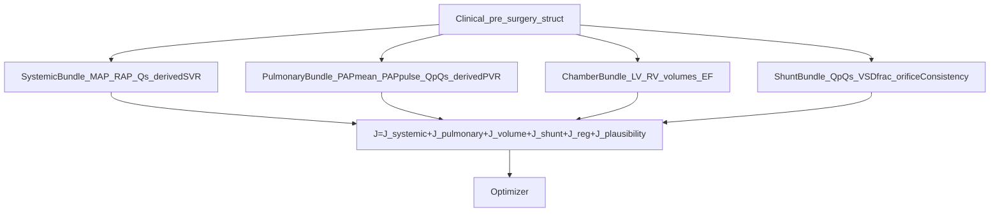

# Reyna systemic flow — next steps plan (no-code)

Date: 2026-05-08
Scope: full restructure (objective + shunt model + priors), **plan only**

## A. Diagnosis (why the current state needs structural changes, not more tuning)

The handoff’s “stop point” is correct. Two upstream issues are doing most of the damage:

**A.1 CO definition is internally inconsistent within the Reyna patient file.**

- In `config/patient_reyna.m`, `pre.CO_Lmin = 3.423 L/min` is taken as Fick Qs, while Teichholz volumes (`LVEDV_mL = 41.0`, `LVESV_mL = 19.3`) imply `LVSV = 21.7 mL` and at typical pediatric HR (~92 bpm) \(LVSV \times HR / 1000 \approx 2.0\) L/min.
- Even allowing for shunt recirculation (`Qp = QpQs * Qs = 1.18 * 3.423 = 4.04 L/min`, so `LVSV * HR` should be ~4.04), the Teichholz volumes still imply ~2 L/min. So **Fick Qs and Teichholz volumes disagree by ~1.7–2.0×** inside the same patient record.
- The patient note already acknowledges this and chose Qs as the calibration anchor. The issue is the optimizer treats this as a hard point target instead of a constrained target with uncertainty.

**A.2 The objective double-counts the systemic quartet.**

- In `src/calibration/objective_calibration.m`:
  - `CO_Lmin` contributes to `J_primary` as an independent metric.
  - `CO_Lmin` contributes again inside `systemic_bundle_penalty` (which already couples Qs, derived SVR, and flow balance).
  - `CO_Lmin` contributes again via `clinical_guard_penalty` (flow metrics).
- SVR is skipped when the systemic bundle is active, but CO is not. Net effect: **CO is penalized multiple times through partially redundant terms**, making it hard to satisfy pressure waveform shape without paying an oversized CO penalty.

**A.3 Other compounding factors flagged by the handoff.**

- Adult-baseline-then-BSA scaling at age 3.17 is `preschool_extrapolated`; current bounds do not explicitly widen for that regime.
- Linear `R.vsd` shunt model misses pressure dependence; an orifice mode (`vsd.Cd`) already exists but is not the default for Reyna.

## B. Recommended CO comparator (defensible default)

Use **model `Qs_Lmin`** (current behavior is `metrics.CO_Lmin = Qsys_Lmin`) as the comparator for Reyna’s catheter Fick CO, but treat it as a **bundle-level target with explicit uncertainty** (e.g., \(\sigma \approx 0.5\) L/min ≈ 15%) rather than a hard primary target.

Rationale:

- Fick CO is a systemic O₂-extraction estimate and corresponds to **systemic flow Qs**, not LV stroke output. In unrepaired VSD, **LVCO = Qp > Qs**, so comparing Fick to LVCO is systematically biased.
- `Qao_Lmin` and `Qs_Lmin` already agree tightly in the systemic audit, so using Qs is internally consistent.
- The Teichholz-vs-Fick mismatch is best treated as measurement inconsistency/uncertainty, not as a flow accounting bug.

## C. Objective architecture (target state)

Key changes vs current structure:

- Treat systemic quartet (`SAP_mean`, `RAP_mean`, `CO_Lmin`, derived `SVR`) as **one coupled bundle** and remove redundant independent penalties for Reyna.
- Remove the `clinical_guard` flow penalty for CO when the systemic bundle is active.
- Convert “Reliability” labels in `src/utils/get_calibration_targets.m` into per-metric uncertainties: `High`=5%, `Moderate`=10%, `Low/Derived`=20%. Use these sigmas instead of hard-coded weight floors.

## D. VSD shunt upgrade

- Switch Reyna pre-surgery default from linear resistance (`R.vsd`) to **orifice bidirectional** mode (`vsd.Cd`).
- Add a derived consistency check: orifice-based shunt flow vs \(Qp - Qs\) from flow accounting; apply a small penalty if they disagree (to prevent “cheating” via unrelated compensations).

## E. Preschool prior re-anchoring

- When `age_validity_band == 'preschool_extrapolated'`, widen selected bounds (especially systemic resistance scale and arterial compliances) and relax plausibility regularization slightly, because the baseline anchor is itself extrapolated.
- Record the fact that preschool-specific widening was applied in the run manifest (so results are reproducible and reviewable).

## F. Diagnostic extension (audit-only)

Extend the existing systemic output audit to always report, per candidate:

- `Qs_Lmin`, `Qao_Lmin`, `LVCO_Lmin`, `Qp_Lmin`
- SVR computed three ways (from Qs, from Qao, from LVCO)
- “Implied Q” if the simulated pressure gradient used the target SVR
- `LVSV * HR` vs `Qp` consistency residual

Write these into `tables/co_definition_audit_<scenario>.csv` for every Reyna run.

## G. Documentation tasks

- Update `docs/clinical_data_dictionary.md` so the Reyna CO field states:
  - comparator = model `Qs_Lmin`
  - clinical method = catheter Fick
  - uncertainty = ±15% (or documented alternative)
  - known inconsistency with Teichholz LV volumes
- Write a short memo (in `.assistant/`) for Pak Dipo: CO-definition decision, objective restructure rationale, orifice switch rationale, preschool-extrapolated framing.
- Align thesis wording toward “physiologically constrained digital shadow” rather than strict patient-specific identifiability.

## H. Validation gate (post-change)

Do one Reyna pre-surgery run after all changes and compare to the recent benchmark:

- Primary gate: ≥4/5 key targets within 10%
- `CO_Lmin` (Qs comparator) error ≤15%
- `SVR` error ≤20%
- 0 parameter plausibility FAIL, ≤3 WARNING
- RMSE within ±15% of current best is acceptable; the goal is correctness and defensibility, not RMSE chasing

## I. Out of scope (explicitly)

- No optimizer algorithm changes
- No new state variables / circuit topology expansions
- No post-surgery work until pre-surgery passes the new validation gate
